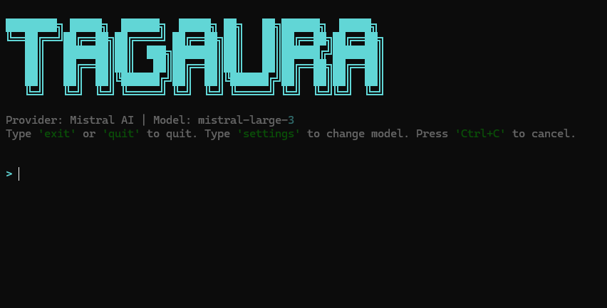

<div align="center">
  <h1>✨ TagAura</h1>
  <p><strong>A Next-Generation, Autonomous AI CLI Agent & System Administrator</strong></p>
</div>

<p align="center">
  
</p>
TagAura is a powerful, autonomous CLI-based AI agent designed to run directly in your terminal. It goes beyond simple chat; it's a fully functional system administrator, developer, and automation tool. Powered by LiteLLM and OpenAI SDK, it supports multiple top-tier models like Mistral, OpenAI, Anthropic, Gemini, DeepSeek, and Groq.

## 🚀 Features

* **🌐 Autonomous Web Search & URL Reading:**
  TagAura isn't isolated. It can search the live web (via DuckDuckGo) and read documentation from URLs to solve complex errors and learn new frameworks on the fly.
* **⌨️ GUI Automation (Mouse & Keyboard Control):**
  Like a true AI Assistant, TagAura can take physical control of your screen. It can execute PyAutoGUI scripts to open apps, click buttons, and type text autonomously.
* **🤖 Multi-Agent Swarm (Sub-Agents):**
  For complex tasks, TagAura can clone itself in the background! It spawns specialized Sub-Agents (e.g., "Senior Code Reviewer" or "Security Expert") to handle sub-tasks and report back to the main agent.
* **⏳ Background Tasks & Cron Jobs:**
  Run heavy processes or scheduled tasks (e.g., checking weather every hour) in the background without freezing your terminal chat interface.
* **🧠 Dual-Layer Memory Architecture:**
  * **Session Memory:** Keeps context during your current active session.
  * **Permanent Memory:** Learns facts about you, your projects, and your preferences, remembering them across restarts.
* **⚡ Autonomous System Execution:**
  TagAura executes commands directly on your system (with safety checks). You don't need to copy-paste scripts. It scans ports, checks active processes, and manages files on its own.
* **🛠️ Native File Operations (Scaffolding & Auto-Healing):**
  * **Scaffolding:** Can build full project directories from scratch instantly.
  * **Auto-Healing:** If a code it wrote crashes, it reads the error log, uses `replace_in_file` to fix the exact broken line, and reruns it autonomously.
* **⚙️ Smart Configuration & Settings:**
  Configures and caches your preferred AI model and API keys. Type `settings` to change them on the fly!
* **🌍 Multi-Language Support:**
  Adapts strictly to the language you speak. Ask in Turkish, it replies in Turkish. Ask in English, it switches instantly.

## 📦 Installation

**1. Clone the repository:**
```bash
git clone https://github.com/Tagiyevff/tagaura.git
cd tagaura
```

**2. Install dependencies via pip:**
```bash
pip install -e .
```

**3. Run the Agent:**
```bash
tga
```
*On first launch, it will guide you to select your preferred AI provider and securely save your API key.*

## 💡 Usage Examples

**Inside the interactive TagAura terminal:**

* **Multi-Agent Coding:**
  > "Write a Snake game in Python on my desktop. Before you show me the code, spawn a 'Senior Python Reviewer' Sub-Agent to test and verify it."
* **Web Search & Fixing Errors:**
  > "Run the `app.py` script. If you get an error, search StackOverflow on the web, read the solution, fix the file natively, and try running it again."
* **GUI Automation & Background Tasks:**
  > "Start a background task. In exactly 1 minute, take control of my mouse, open the Start Menu, type 'Notepad', and write 'TagAura is alive!'"
* **Memory Test:**
  > "My name is Ramin and I'm a developer. Remember this." (Later) -> "Who am I?"

## ⚙️ Built-in Commands

If you don't want to chat and just need a quick utility, TagAura acts as a CLI toolkit:
* `tga scan_network` - Network analysis
* `tga clean` - System temp cleaning
* `tga processes` - Process monitoring
* `tga settings` - Change your default LLM provider and model

## ⚠️ Security Warning

TagAura can execute real commands on your host operating system and take physical control of your mouse/keyboard. While dangerous commands (like `rm`, `format`, `del`) are intercepted and require explicit human-in-the-loop (Y/N) confirmation, you should still supervise its actions carefully. To abort a runaway GUI automation, violently move your mouse to any corner of the screen (Failsafe trigger).


---
*Built with ❤️ for true autonomous terminal control.*
